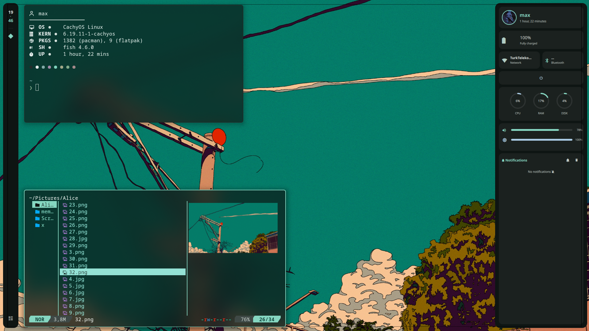
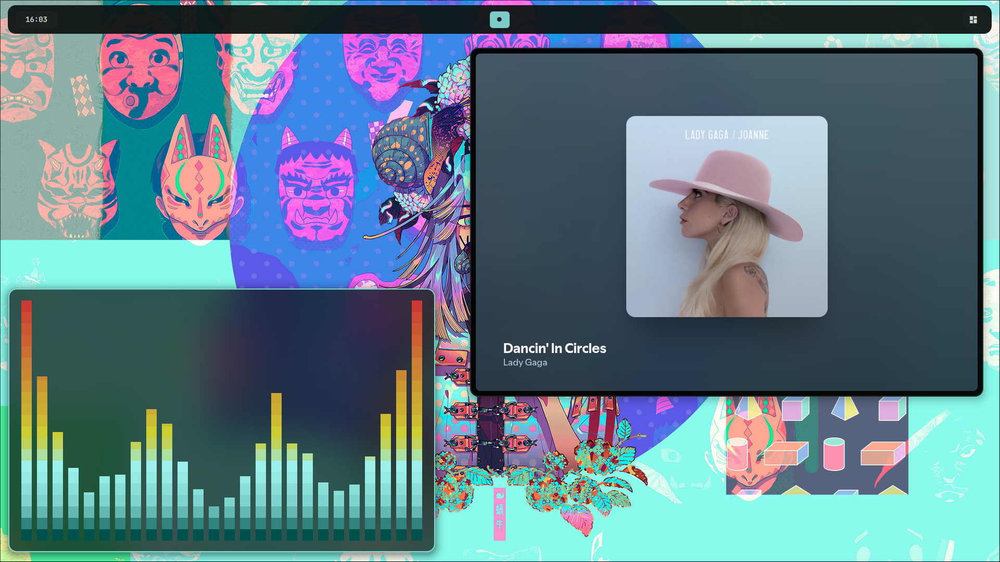
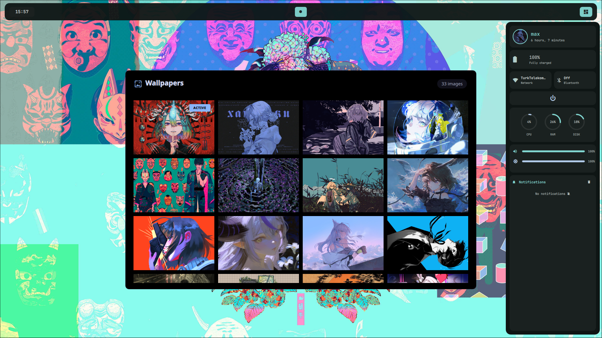
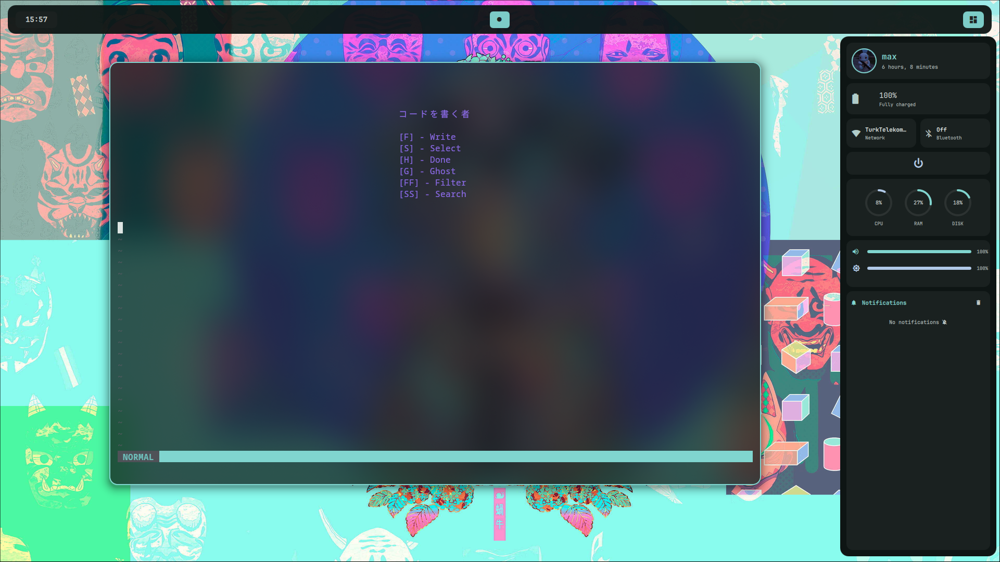
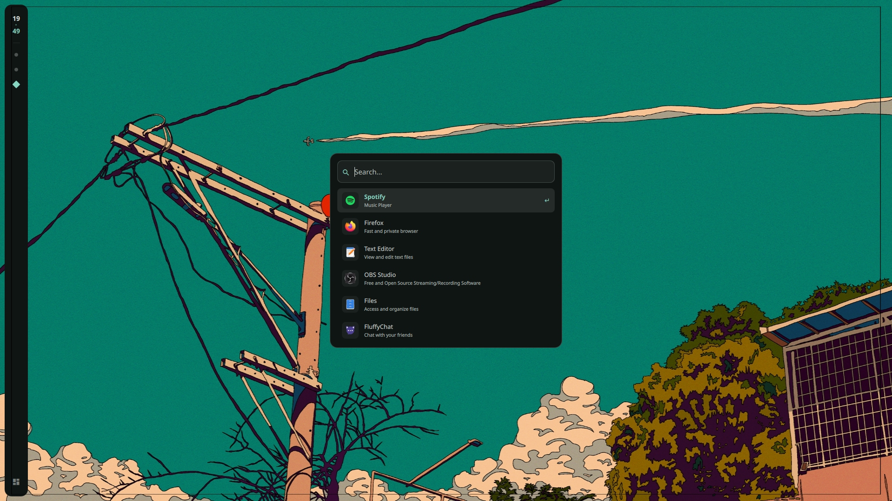

# vroomies 💧

## Keybinds

### ⚡ Launch Applications

| Action                 | Keybind                    | Description                          |
|------------------------|----------------------------|--------------------------------------|
| Terminal               | `SUPER + RETURN`           | Launch terminal ( kitty )            |
| File Manager (yazi)    | `SUPER + SHIFT + RETURN`   | Launch yazi                          |
| window  (floating)     | `SUPER + F `               | floating window                      |
| Browser                | `SUPER + W`                | Launch your default browser          |
| App Launcher / Menu    | `SUPER + D`                | Launch application menu (`$menu`)    |
| Select Wallpaper       | `SUPER + SHIFT + A`        | Run wallpaper selector script        |

---

## Details

- OS: **[Fedora Linux](https://get.fedoraproject.org)**
- DE: **[Hyprland](https://github.com/hyprwm/Hyprland)**
- Terminal: **[Kitty](https://github.com/kovidgoyal/kitty)**
- Music Player: **[spotify](https://open.spotify.com/)**
- Shell: **[zsh](https://github.com/zsh-users/zsh)**
- Bar: **[Quickshell](https://quickshell.org/)**
- App Launcher: **[Quickshell](https://quickshell.org/)**
- Editor: **[Neovim](https://github.com/neovim/neovim)**
- File Manager: **[yazi](https://github.com/sxyazi/yazi)**

# Gallery 

## 🤝 Credits
Special thanks to the [r/hyprland](https://www.reddit.com/r/hyprland/) community for the inspiration.

Special thanks to the [r/Quickshell](https://www.reddit.com/r/QuickShell/) community for the inspiration.

## History
<a href="https://www.star-history.com/?repos=zzzyyyuuuuu%2Fvroomies&type=date&legend=top-left">
 <picture>
   <source media="(prefers-color-scheme: dark)" srcset="https://api.star-history.com/image?repos=zzzyyyuuuuu/vroomies&type=date&theme=dark&legend=top-left" />
   <source media="(prefers-color-scheme: light)" srcset="https://api.star-history.com/image?repos=zzzyyyuuuuu/vroomies&type=date&legend=top-left" />
   
 </picture>
